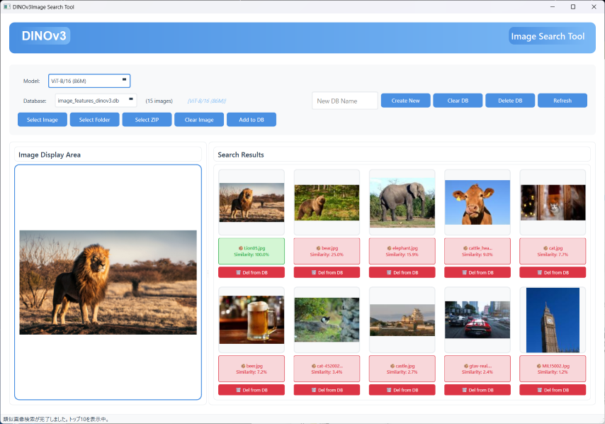

# DINOv3画像検索ツール

**日本語 | [English](README_en.md)**



DINOv3（Vision Transformer）を使用した画像検索アプリケーションです。PyQt6で美しいGUIを提供し、画像の特徴量を使った類似画像検索が可能です。

## 特徴

- **DINOv3モデル**: Facebookの最新自己教師あり学習モデルを使用
- **画像検索**: 画像から類似画像を検索
- **データベース管理**: SQLiteで特徴量を永続化
- **フォルダ/ZIP処理**: 画像の一括登録
- **美しいGUI**: PyQt6でモダンなUI
- **ドラッグ&ドロップ**: 簡単な操作性

## インストール

### 必要な環境
- Python 3.8以上
- CUDA対応GPU（推奨、CPUでも動作）

### 依存関係のインストール

```bash
pip install -r requirements_dinov3.txt
```

## 使い方

### 1. アプリケーションの起動

```bash
python dinov3_search.py
```

初回起動時にDINOv3モデルが自動的にダウンロードされます。

### 2. 画像の追加

#### 方法1: ドラッグ&ドロップ
- 画像ファイルを画像表示エリアにドラッグ&ドロップ

#### 方法2: ボタンから選択
- 「画像を選択」ボタンをクリック
- 「フォルダを選択」ボタンで一括登録
- 「ZIPを選択」ボタンでZIP内の画像を一括登録

### 3. 画像検索

1. 画像をドロップまたは選択
2. 自動的に類似画像が検索され、右側に表示されます
3. 類似度（0-100%）で色分け表示

### 4. データベース管理

- **新規作成**: 新しいデータベースを作成
- **DB消去**: 現在のデータベースの内容を消去
- **DB削除**: データベースファイルを完全に削除
- **更新**: データベースリストを更新

## 主な機能

### 画像検索
- 画像から類似画像を検索
- コサイン類似度でランキング表示
- トップ10の類似画像を表示

### データベース
- SQLiteで特徴量を保存
- 重複チェック（MD5ハッシュ）
- サムネイル自動生成

### バッチ処理
- フォルダ内の画像を一括登録
- ZIPファイル内の画像を一括登録
- 進捗表示

## 技術仕様

### DINOv3モデル
- モデル: `facebook/dinov2-base`
- 入力サイズ: 224x224
- 特徴量: 768次元（CLSトークン）

### データベーススキーマ

#### imagesテーブル
- id: 画像ID（主キー）
- file_path: ファイルパス
- file_hash: MD5ハッシュ
- thumbnail: サムネイル画像（BLOB）

#### featuresテーブル
- image_id: 画像ID（外部キー）
- feature_vector: 特徴量ベクトル（BLOB）

## CLIPとの違い

### DINOv3の特徴
- ✅ 画像のみの特徴抽出に特化
- ✅ 自己教師あり学習で訓練
- ✅ 高品質な画像特徴量
- ❌ テキスト検索は非対応

### CLIPの特徴
- ✅ 画像とテキストの両方に対応
- ✅ テキストから画像検索が可能
- ✅ マルチモーダル学習

## トラブルシューティング

### モデルのダウンロードに失敗する
- インターネット接続を確認
- Hugging Faceへのアクセスを確認

### 特徴量抽出が遅い
- GPUが利用可能か確認
- CUDAが正しくインストールされているか確認

### メモリ不足エラー
- 画像サイズを小さくする
- バッチ処理の際は少量ずつ処理

## ライセンス

このプロジェクトはMITライセンスの下で公開されています。

## 参考

- [DINOv3 GitHub](https://github.com/facebookresearch/dinov3)
- [Hugging Face - DINOv2](https://huggingface.co/facebook/dinov2-base)
