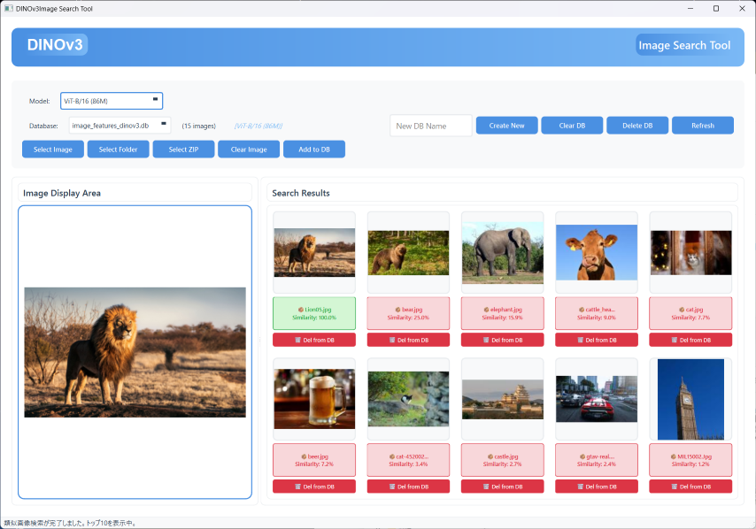

# DINOv3 Image Search Tool

**[日本語](README.md) | English**



An image search application using DINOv3 (Vision Transformer). Provides a beautiful GUI with PyQt6 and enables similar image search using image features.

## Features

- **DINOv3 Model**: Uses Facebook's latest self-supervised learning model
- **Image Search**: Search for similar images from an image
- **Database Management**: Persist features with SQLite
- **Folder/ZIP Processing**: Batch image registration
- **Beautiful GUI**: Modern UI with PyQt6
- **Drag & Drop**: Easy operation

## Installation

### Requirements
- Python 3.8 or higher
- CUDA-compatible GPU (recommended, but works with CPU)

### Install Dependencies

```bash
pip install -r requirements_dinov3.txt
```

## Usage

### 1. Launch the Application

```bash
python dinov3_search_en.py
```

The DINOv3 model will be automatically downloaded on the first launch.

### 2. Add Images

#### Method 1: Drag & Drop
- Drag and drop image files to the image display area

#### Method 2: Select from Buttons
- Click "Select Image" button
- Click "Select Folder" button for batch registration
- Click "Select ZIP" button to batch register images in ZIP

### 3. Model Selection

- Select a DINOv3 model from the dropdown menu at the top of the GUI
- A confirmation dialog appears when changing models
- Model information is recorded for each database
- The model used is displayed next to the database name (e.g., `[ViT-B/16 (86M)]`)

### 4. Image Search

1. Drop or select an image
2. Similar images are automatically searched and displayed on the right
3. Color-coded display by similarity (0-100%)

### 5. Database Management

- **Create**: Create a new database
- **Clear DB**: Clear the contents of the current database
- **Delete DB**: Completely delete the database file
- **Refresh**: Update the database list
- **Model Info**: Model used is automatically recorded for each database with mismatch warnings

## Main Features

### Image Search
- Search for similar images from an image
- Ranking display by cosine similarity
- Display top 10 similar images

### Database
- Save features with SQLite
- Duplicate check (MD5 hash)
- Automatic thumbnail generation
- Automatic model information recording and management
- Warning function for model mismatch

### Batch Processing
- Batch register images in a folder
- Batch register images in a ZIP file
- Progress display

## Technical Specifications

### DINOv3 Model
- Default model: `facebook/dinov3-vitb16-pretrain-lvd1689m`
- Input size: 224x224
- Features: 768 dimensions (pooler_output)
- Library: Hugging Face Transformers

#### Available Models

**Vision Transformer (ViT) Models - LVD-1689M Dataset:**
- **ViT-S/16 (21M)**: Smallest and fastest model. Low memory usage, works on CPU
- **ViT-S+/16 (29M)**: Improved version of ViT-S. Slightly better accuracy
- **ViT-B/16 (86M)**: Balanced model. Good balance between accuracy and speed (default)
- **ViT-L/16 (300M)**: Large model. High accuracy but requires GPU
- **ViT-H+/16 (840M)**: Extra large model. Highest accuracy but requires high-end GPU
- **ViT-7B/16 (6.7B)**: Largest model. For research purposes, requires very high-end GPU

**ConvNeXt Models - LVD-1689M Dataset:**
- **ConvNeXt Tiny (29M)**: Lightweight convolution-based model
- **ConvNeXt Small (50M)**: Standard ConvNeXt model
- **ConvNeXt Base (89M)**: Balanced ConvNeXt model
- **ConvNeXt Large (198M)**: Large ConvNeXt. GPU recommended

**Satellite Imagery Specialized Models - SAT-493M Dataset:**
- **ViT-L/16 SAT (300M)**: Optimized for satellite imagery and remote sensing
- **ViT-7B/16 SAT (6.7B)**: Largest model for satellite imagery

**Model Selection Guidelines:**
- **CPU Environment**: ViT-S/16, ViT-S+/16
- **GPU (<8GB)**: ViT-B/16, ConvNeXt Tiny/Small
- **GPU (8GB+)**: ViT-L/16, ConvNeXt Base/Large
- **High-end GPU (24GB+)**: ViT-H+/16
- **Satellite/Aerial Imagery**: ViT-L/16 SAT

### Database Schema

#### images table
- id: Image ID (primary key)
- file_path: File path
- file_hash: MD5 hash
- thumbnail: Thumbnail image (BLOB)

#### features table
- image_id: Image ID (foreign key)
- feature_vector: Feature vector (BLOB)

## Differences from CLIP

### DINOv3 Features
- ✅ Specialized in image-only feature extraction
- ✅ Trained with self-supervised learning
- ✅ High-quality image features
- ❌ Text search not supported

### CLIP Features
- ✅ Supports both images and text
- ✅ Can search images from text
- ✅ Multimodal learning

## Troubleshooting

### Model download fails
- Check internet connection
- Check access to Hugging Face

### Feature extraction is slow
- Check if GPU is available
- Check if CUDA is installed correctly

### Out of memory error
- Reduce image size
- Process in smaller batches during batch processing

## License

This project is released under the MIT License.

## References

- [DINOv3 Paper](https://arxiv.org/abs/2304.07193)
- [Hugging Face - DINOv3](https://huggingface.co/facebook/dinov3-vitb16-pretrain-lvd1689m)
